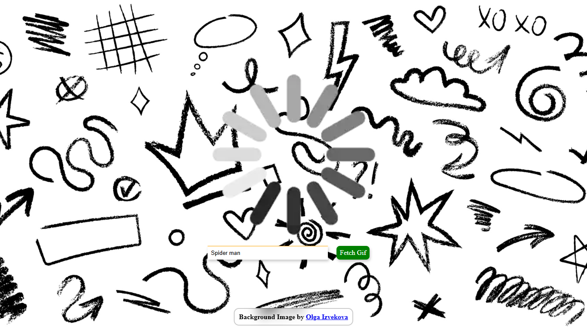
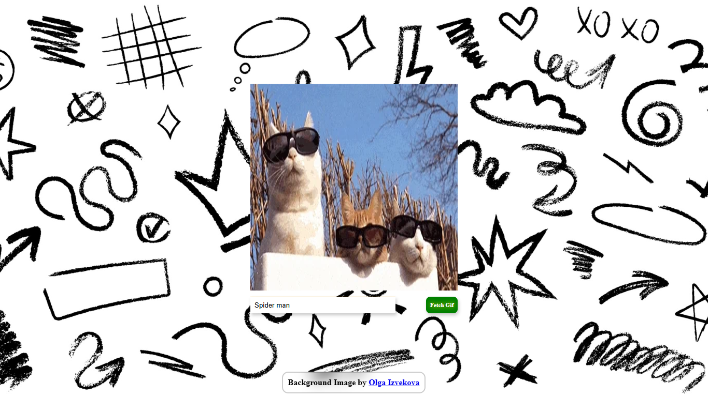
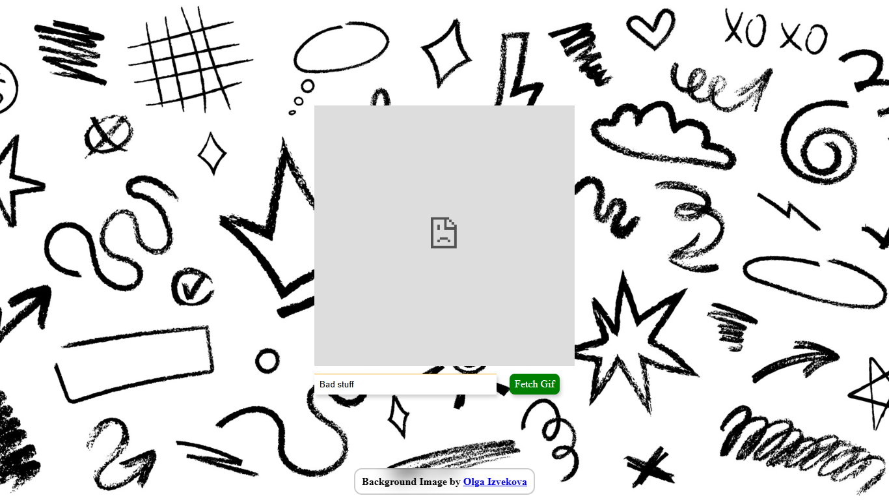
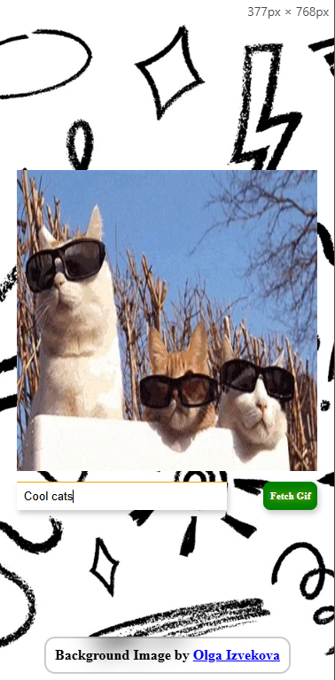

# Gifzz 🎞️

**Gifzz** is a simple and fun web app that allows users to search for gifs using the Giphy API. Just type in your search term, click the button, and a relevant gif will be displayed.

## Features

* Fetch gifs from Giphy using search terms
* Auto-fetch a default gif on page load
* Smooth loading indicator while fetching
* Input validation
* UI blocking during API fetch
* Fully responsive and styled interface

## Technologies Used

* HTML5
* CSS3 (with modern responsive styling)
* JavaScript (ES6+)
* [Giphy Translate API](https://developers.giphy.com/docs/api/endpoint#translate)

## Things I Learned 👨‍💻

This project helped reinforce and practice several core JavaScript and frontend concepts:

* ✅ **Promises** — Used `.then()` and `.catch()` to handle asynchronous API responses
* ✅ **Asynchronous Programming** — Used `fetch()` with `async` behavior and graceful error handling
* ✅ **API Integration** — Built a query with URLSearchParams and connected to an external REST API
* ✅ **Async/Await** — Handled promises with `async` and `await` in place of chaining `.then()`s
* ✅ **Error Handling Using Try/Catch** — Properly handled errors using a `try` `catch` block 

## Screenshots

### Loading State

### Fetched Gif Display

### Error feedback image

### Mobile version

## External Resources & Attribution

* Background image by [Olga Izvekova](https://www.vecteezy.com/members/olga_izvekova) via Vecteezy
* [Giphy API](https://developers.giphy.com/docs/api/)

